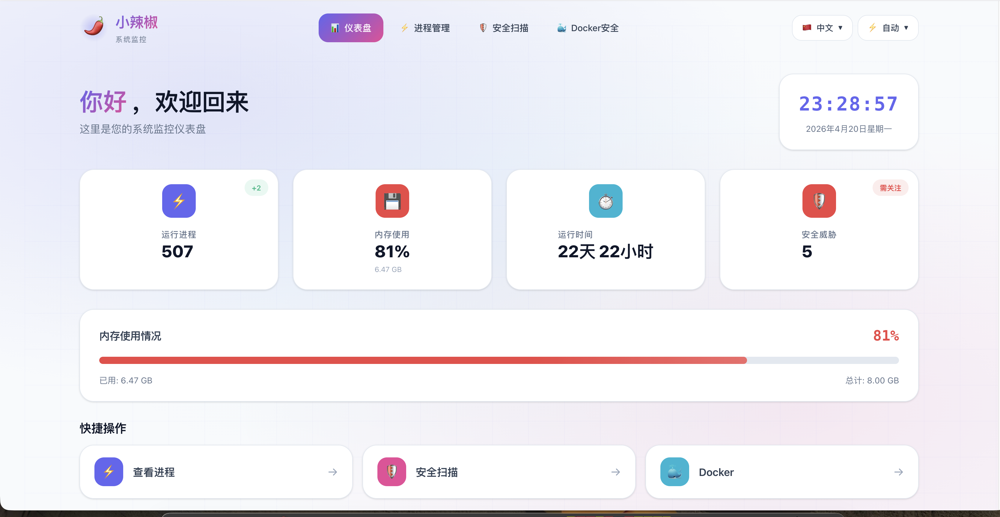

# 小辣椒 Chilli

<div align="center">

**系统遥测与网络安全监控平台**

[](https://www.rust-lang.org)
[](https://github.com/tokio-rs/axum)
[](https://www.sea-ql.org/SeaORM)
[](https://vuejs.org)
[](LICENSE)



</div>

---

## 项目简介

**小辣椒 (Chilli)** 是一个基于 Rust + Vue.js 构建的高性能系统遥测与网络安全监控平台。它集成了实时进程监控、安全漏洞扫描、Docker 容器管理、系统状态采集等功能，为开发者和运维人员提供全面的系统可视化和安全态势感知能力。

### 核心特性

- **可视化仪表盘** - 基于 Vue 3 的现代化 Web 界面，实时展示系统状态
- **实时进程监控** - 采集系统进程信息、内存使用、端口监听状态
- **安全漏洞扫描** - 自动检测系统进程和服务的安全漏洞
- **Docker 安全管理** - 监控容器运行状态和安全配置
- **GitHub 安全公告同步** - 自动同步安全漏洞数据库
- **系统遥测** - CPU、内存、运行时间等关键指标实时采集
- **多语言支持** - 支持中文和英文界面切换
- **RESTful API** - 基于 Axum 框架的高性能 HTTP API
- **多数据库支持** - SQLite / MySQL / PostgreSQL / QuestDB
- **异步高性能** - 基于 Tokio 异步运行时，资源占用低

---

## 系统架构

```
┌─────────────────────────────────────────────────────────────┐
│                      Frontend Layer                          │
│  ┌─────────────┐  ┌─────────────┐  ┌─────────────────────┐  │
│  │  Dashboard  │  │   Security  │  │   Docker Manager    │  │
│  │   仪表盘    │  │   安全扫描  │  │    容器管理         │  │
│  └─────────────┘  └─────────────┘  └─────────────────────┘  │
│                         Vue 3 + TypeScript                   │
└─────────────────────────────────────────────────────────────┘
                              │
┌─────────────────────────────────────────────────────────────┐
│                        HTTP API Layer                        │
│  ┌─────────────┐  ┌─────────────┐  ┌─────────────────────┐  │
│  │  /health    │  │ /api/running│  │   /api/kill/:pid    │  │
│  │  健康检查   │  │  进程列表   │  │    终止进程         │  │
│  └─────────────┘  └─────────────┘  └─────────────────────┘  │
│  ┌─────────────┐  ┌─────────────┐  ┌─────────────────────┐  │
│  │/security/scan│ │/security/docker│ │  /api/processes    │  │
│  │  漏洞扫描   │  │ Docker安全  │  │    进程详情         │  │
│  └─────────────┘  └─────────────┘  └─────────────────────┘  │
│                         Axum (Rust)                          │
└─────────────────────────────────────────────────────────────┘
                              │
┌─────────────────────────────────────────────────────────────┐
│                      Business Logic Layer                    │
│  ┌──────────────────┐  ┌────────────────────────────────┐  │
│  │  Process Monitor │  │  Security Scanner              │  │
│  │  进程监控核心    │  │  漏洞扫描引擎                  │  │
│  └──────────────────┘  └────────────────────────────────┘  │
│  ┌──────────────────┐  ┌────────────────────────────────┐  │
│  │  Docker Security │  │  GitHub Advisory Sync          │  │
│  │  容器安全检测    │  │  安全公告同步引擎              │  │
│  └──────────────────┘  └────────────────────────────────┘  │
└─────────────────────────────────────────────────────────────┘
                              │
┌─────────────────────────────────────────────────────────────┐
│                      Data Access Layer                       │
│         SeaORM (SQLite / MySQL / PostgreSQL)                │
└─────────────────────────────────────────────────────────────┘
```

---

## 快速开始

### 方式一：使用 Docker（推荐）

```bash
# 使用 Docker 运行
docker run -d \
  --name chilli \
  -p 9333:9333 \
  -v $(pwd)/data:/data \
  ctkqiang/chilli:latest

# 或使用 Docker Compose
docker-compose up -d
```

访问 http://localhost:9333 即可使用 Web 界面。

### 方式二：从源码构建

#### 环境要求

- Rust 1.75+
- Node.js 18+ (前端开发)
- SQLite (默认) 或 MySQL/PostgreSQL

#### 安装

```bash
# 克隆仓库
git clone https://github.com/ctkqiang/chilli.git

或

git https://gitcode.com/ctkqiang_sr/chilli.git

cd chilli

# 编译后端
cargo build --release

# 编译前端
cd portal
npm install
npm run build
cd ..

# 运行
./target/release/chilli
```

前端构建后的文件将自动嵌入到后端二进制中，访问 http://localhost:9333 即可使用 Web 界面。

### 配置

创建 `.env` 文件：

```env
# 服务端口
PORT=9333

# 数据库配置 (SQLite - 默认)
DATABASE_URL=sqlite://./data/chilli.db

# 或 MySQL
# MYSQL_HOST=localhost
# MYSQL_USER=root
# MYSQL_PASSWORD=password
# MYSQL_DATABASE=chilli

# 或 PostgreSQL
# POSTGRES_HOST=localhost
# POSTGRES_USER=postgres
# POSTGRES_PASSWORD=password
# POSTGRES_DATABASE=chilli
```

---

## 功能模块

### 仪表盘

系统概览页面，展示关键指标：

- 运行进程数量
- 内存使用率
- 系统运行时间
- 安全威胁统计
- 快捷操作入口

### 进程管理

- 查看所有运行中的进程
- 搜索和筛选进程
- 查看进程详细信息（PID、内存、端口等）
- 终止进程
- 实时更新进程状态

### 安全扫描

- 自动扫描系统进程的安全漏洞
- 检测常见服务的已知漏洞
- 展示漏洞严重等级（严重/高危/中危/低危）
- 提供漏洞详情和修复建议
- 支持手动重新扫描

### Docker 安全

- 查看 Docker 容器列表
- 检测容器安全配置问题
- 识别特权模式、敏感挂载等风险
- 展示容器资源使用情况

---

## API 接口

### 系统状态

| 方法 | 路径      | 描述     |
| ---- | --------- | -------- |
| GET  | `/`       | 服务信息 |
| GET  | `/health` | 健康检查 |

### 进程管理

| 方法 | 路径             | 描述               |
| ---- | ---------------- | ------------------ |
| GET  | `/api/running`   | 获取运行中进程列表 |
| POST | `/api/kill/:pid` | 终止指定进程       |

### 安全扫描

| 方法 | 路径                   | 描述             |
| ---- | ---------------------- | ---------------- |
| GET  | `/api/security/scan`   | 执行系统漏洞扫描 |
| GET  | `/api/security/docker` | 扫描 Docker 安全 |

### 安全公告

| 方法 | 路径                   | 描述               |
| ---- | ---------------------- | ------------------ |
| GET  | `/api/advisories`      | 获取同步的安全公告 |
| POST | `/api/advisories/sync` | 手动触发同步       |

---

## 技术栈

### 后端

| 组件                                     | 用途            |
| ---------------------------------------- | --------------- |
| [Axum](https://github.com/tokio-rs/axum) | Web 框架        |
| [Tokio](https://tokio.rs)                | 异步运行时      |
| [SeaORM](https://www.sea-ql.org/SeaORM)  | ORM 框架        |
| [Serde](https://serde.rs)                | 序列化/反序列化 |
| [sysinfo](https://docs.rs/sysinfo)       | 系统信息采集    |
| [listeners](https://docs.rs/listeners)   | 端口监听检测    |
| [reqwest](https://docs.rs/reqwest)       | HTTP 客户端     |

### 前端

| 组件                                         | 用途        |
| -------------------------------------------- | ----------- |
| [Vue 3](https://vuejs.org)                   | 前端框架    |
| [TypeScript](https://www.typescriptlang.org) | 类型系统    |
| [Pinia](https://pinia.vuejs.org)             | 状态管理    |
| [Vue Router](https://router.vuejs.org)       | 路由管理    |
| [vue-i18n](https://vue-i18n.intlify.dev)     | 国际化      |
| [Axios](https://axios-http.com)              | HTTP 客户端 |
| [Vite](https://vitejs.dev)                   | 构建工具    |

---

## 测试

```bash
# 运行所有测试
cargo test

# 运行单元测试
cargo test --lib

# 运行集成测试
cargo test --test integration_tests

# 生成测试覆盖率报告
cargo tarpaulin --out Html
```

---

## 项目结构

```
chilli/
├── src/                    # 后端源码
│   ├── core/              # 核心业务逻辑
│   ├── models/            # 数据模型
│   ├── routes/            # API 路由
│   ├── utils/             # 工具函数
│   └── main.rs            # 入口文件
├── portal/                # 前端源码
│   ├── src/               # Vue 源码
│   │   ├── views/         # 页面组件
│   │   ├── stores/        # Pinia 状态
│   │   └── locales/       # 国际化文件
│   └── dist/              # 构建输出
├── docs/                  # 文档和图片
│   └── demo.png           # 界面预览图
├── Cargo.toml            # Rust 依赖
└── README.md             # 项目说明
```

---

**如果这个项目对你有帮助，请给它一个 ⭐️ 星标！**

</div>

---

### 🌐 全球捐赠通道

#### 国内用户

<div align="center" style="margin: 40px 0">

<div align="center">
<table>
<tr>
<td align="center" width="300">

<br />
<strong>🔵 支付宝</strong>（小企鹅在收金币哟~）
</td>
<td align="center" width="300">

<br />
<strong>🟢 微信支付</strong>（小绿龙在收金币哟~）
</td>
</tr>
</table>
</div>
</div>

#### 国际用户

<div align="center" style="margin: 40px 0">
  <a href="https://qr.alipay.com/fkx19369scgxdrkv8mxso92" target="_blank">
    
  </a>
  
  <a href="https://ko-fi.com/F1F5VCZJU" target="_blank">
    
  </a>
  
  <a href="https://www.paypal.com/paypalme/ctkqiang" target="_blank">
    
  </a>
  
  <a href="https://donate.stripe.com/00gg2nefu6TK1LqeUY" target="_blank">
    
  </a>
</div>

---

### 📌 开发者社交图谱

#### 技术交流

<div align="center" style="margin: 20px 0">
  <a href="https://github.com/ctkqiang" target="_blank">
    
  </a>
  
  <a href="https://stackoverflow.com/users/10758321/%e9%92%9f%e6%99%ba%e5%bc%ba" target="_blank">
    
  </a>
  
  <a href="https://www.linkedin.com/in/ctkqiang/" target="_blank">
    
  </a>
</div>

#### 社交互动

<div align="center" style="margin: 20px 0">
  <a href="https://www.instagram.com/ctkqiang" target="_blank">
    
  </a>
  
  <a href="https://twitch.tv/ctkqiang" target="_blank">
    
  </a>
  
  <a href="https://github.com/ctkqiang/ctkqiang/blob/main/assets/IMG_9245.JPG?raw=true" target="_blank">
    
  </a>
</div>
